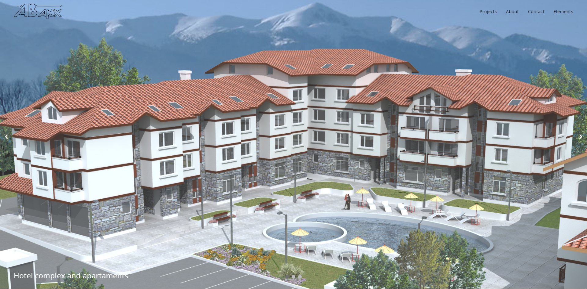

# Web project

## About the project

This website is about an architecture studio.  

[Link](https://veselin-angelov.github.io/webproject/dist/)

## Getting Started

### Dependencies

*__Note:__ if you've previously installed Gulp globally, run `npm rm --global gulp` to remove it. [Details here.](https://medium.com/gulpjs/gulp-sips-command-line-interface-e53411d4467)*

Make sure these are installed first.

- [Node.js](http://nodejs.org)
- [Gulp Command Line Utility](http://gulpjs.com) `npm install --global gulp-cli`

### Quick Start

1. In bash/terminal/command line, `cd` into your project directory.
2. Run `npm install` to install required files and dependencies.
3. When it's done installing, run one of the task runners to get going:
	- `gulp` manually compiles files.
	- `gulp watch` automatically compiles files and applies changes using [BrowserSync](https://browsersync.io/) when you make changes to your source files.